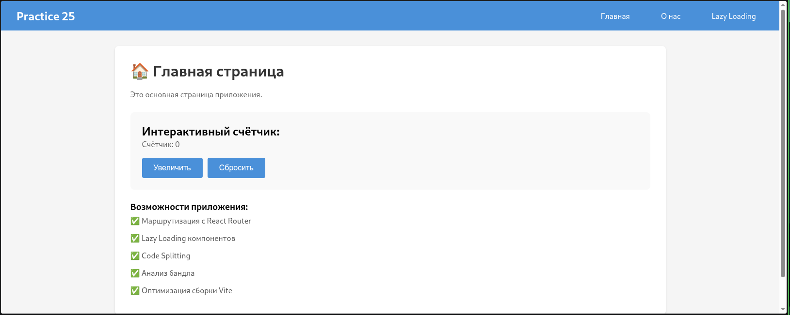
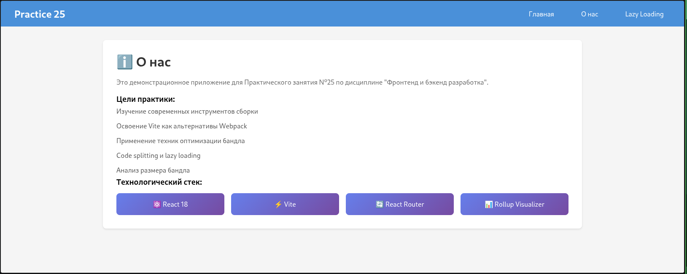
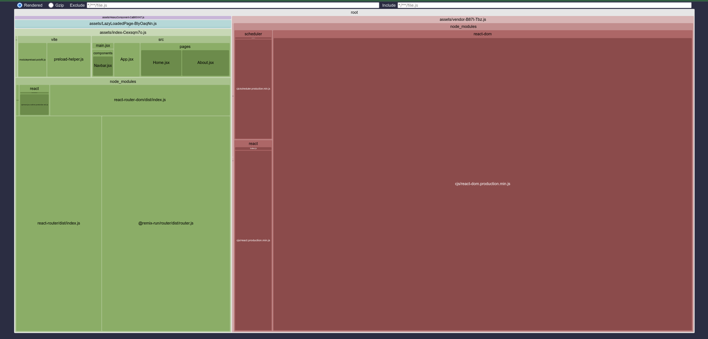

# Практическое занятие №25: Инструменты сборки (Vite + React)

**Студент:** Кайзер Даниил Дмитриевич  
**Группа:** ЭФБО-08-24  
**Дисциплина:** Фронтенд и бэкенд разработка  
**Тема:** Инструменты сборки: Webpack и Vite, оптимизация бандла (Lazy Loading, Code Splitting).

---

## 1. Описание реализации

В рамках данного практического занятия было создано React-приложение, собранное с помощью современного сборщика **Vite**. Проект демонстрирует навыки настройки маршрутизации, внедрения оптимизаций загрузки через Lazy Loading и анализа размера итогового бандла приложения.

### Ключевые изменения и функции:
*   **Сборщик Vite:** Использован для мгновенной разработки (HMR) и быстрой Production-сборки.
*   **Маршрутизация:** Реализована через `react-router-dom`. Приложение содержит две страницы: «Главная» (Home) и «О нас» (About).
*   **Lazy Loading (Ленивая загрузка):** Реализовано разделение кода (Code Splitting) для тяжелых компонентов. Компонент на странице «О нас» загружается динамически через `React.lazy` и `Suspense`.
*   **Анализ бандла:** В сборку интегрирован плагин `rollup-plugin-visualizer`, который генерирует интерактивную карту зависимостей после сборки.

---





## 2. Структура проекта

```text
practice25-vite/
├── node_modules/
├── public/
├── src/
│   ├── components/
│   │   ├── Navbar.jsx            # Навигационное меню
│   │   └── HeavyChart.jsx        # "Тяжелый" компонент (загружается лениво)
│   ├── pages/
│   │   ├── Home.jsx              # Страница "Главная"
│   │   └── About.jsx             # Страница "О нас" (использует Suspense)
│   ├── App.jsx                   # Корневой компонент с роутами
│   ├── main.jsx                  # Точка входа
│   └── index.css
├── dist/                         # Директория сборки (появляется после build)
├── stats.html                    # Отчет анализатора бандла
├── index.html
├── package.json
└── vite.config.js                # Конфигурация Vite с плагином анализа
```

---

## 3. Реализация требований

### 🔹 Настройка Vite и плагинов
Для визуализации размера бандла в `vite.config.js` добавлен плагин `rollup-plugin-visualizer`:

```javascript
// vite.config.js
import { defineConfig } from 'vite'
import react from '@vitejs/plugin-react'
import { visualizer } from 'rollup-plugin-visualizer'

export default defineConfig({
  plugins: [
    react(),
    visualizer({
      filename: 'stats.html',   // Файл отчета
      open: true,               // Открыть в браузере после сборки
      gzipSize: true            // Показать размер после сжатия Gzip
    })
  ],
})
```

### 🔹 Lazy Loading (React.lazy)
В файле `src/pages/About.jsx` компонент карты (`HeavyChart`) загружается только при посещении этой страницы:

```jsx
import { Suspense, lazy } from 'react';

// Компонент загружается только когда рендерится страница "О нас"
const HeavyChart = lazy(() => import('../components/HeavyChart'));

function About() {
  return (
    <div>
      <h1>О нас</h1>
      <Suspense fallback={<p>⏳ Загрузка компонента...</p>}>
        <HeavyChart />
      </Suspense>
    </div>
  );
}
```

---

## 4. Инструкция по запуску

### Предварительные требования
*   Установленный **Node.js** (версия 18+).
*   Менеджер пакетов **npm**.

### Шаг 1: Установка зависимостей
```bash
npm install
```

### Шаг 2: Запуск режима разработки
```bash
npm run dev
```
Приложение будет доступно по адресу: `http://localhost:5173`

### Шаг 3: Сборка и анализ
Для выполнения практического задания необходимо собрать проект и открыть отчет:

1.  **Сборка:**
    ```bash
    npm run build
    ```
2.  **Анализ:**
    После успешной сборки файл `stats.html` должен открыться автоматически (или откройте его из корня проекта). На карте будет видно разделение кода на чанки (Chunks).

---

## 5. Тестирование и Результаты

1.  **Проверка маршрутизации:** Переходы между страницами `Home` и `About` работают корректно, URL меняется без перезагрузки страницы.
2.  **Проверка Lazy Loading:** В консоли браузера (вкладка Network) при переходе на `About` видно отдельный запрос на файл `.js` (чанк), что подтверждает ленивую загрузку.
3.  **Анализ бандла:** Файл `stats.html` демонстрирует структуру итоговых файлов, размер основных зависимостей (React, Router) и размер ленивого чанка (`HeavyChart`).

---

## 6. Соответствие требованиям практики №25

| Требование | Реализация | Статус |
| :--- | :--- | :---: |
| Создать React-приложение на Vite (или Webpack) | Использован Vite + React | ✅ |
| Реализовать минимум два маршрута | Реализованы маршруты `/` и `/about` | ✅ |
| Применить Lazy Loading (`React.lazy` + `Suspense`) | Реализовано для компонента `HeavyChart` на странице `/about` | ✅ |
| Добавить анализатор бандла | Интегрирован `rollup-plugin-visualizer` | ✅ |
| Убедиться, что production-сборка выполняется без ошибок | Команда `npm run build` выполняется успешно | ✅ |