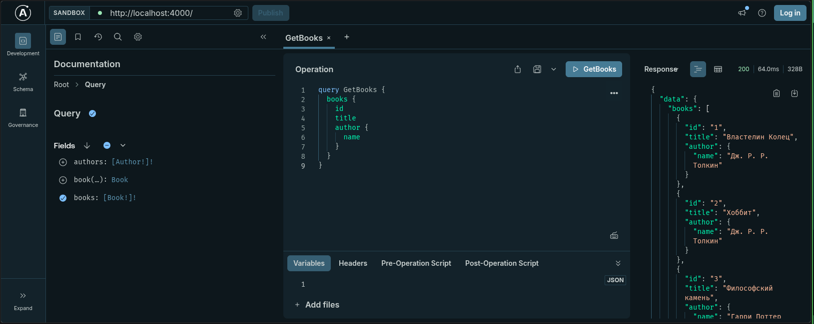
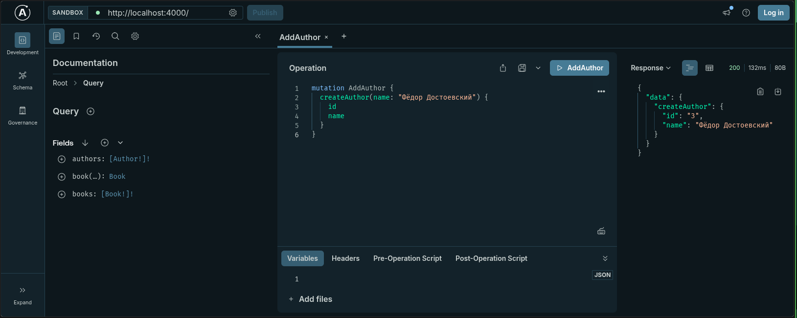
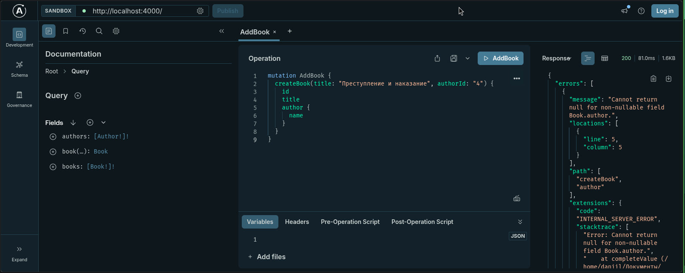

# Практическое занятие №26: GraphQL и Apollo

**Студент:** Кайзер Даниил Дмитриевич
**Группа:** ЭФБО-08-24
**Дисциплина:** Фронтенд и бэкенд разработка

## 1. Описание реализации
В рамках данного практического занятия был реализован GraphQL API для управления каталогом книг с использованием Apollo Server. Реализована связь "один-ко-многим" (Author - Books).

### Ключевые особенности:
* **Схема (SDL):** Строгое типизирование данных (`Author`, `Book`).
* **Резолверы:** Написана логика для запросов (`Query`), мутаций (`Mutation`) и связей (вложенные поля).
* **Apollo Sandbox:** Использован встроенный инструмент для тестирования API.

## 2. Структура проекта
```text
practic26/
├── node_modules/
├── package.json
├── server.mjs        # Основной файл сервера
└── README.md         # Отчёт
```

## 3. Тестирование API (Скриншоты из Apollo Sandbox)

### 3.1. Получение списка книг и их авторов
Запрос `books` с вложенным полем `author`.



### 3.2. Мутация создания автора
Создание автора "Фёдор Достоевский".



### 3.3. Мутация создания книги
Привязка книги к автору по `authorId`.



## 4. Соответствие требованиям практики №26
| Требование | Реализация |
| --- | --- |
| Схема GraphQL (Book/Author) | ✅ Реализована |
| Query (списки и поиск) | ✅ `books`, `book(id)`, `authors` |
| Mutation (создание) | ✅ `createAuthor`, `createBook` |
| Резолверы (вложенные) | ✅ Поля `author` в `Book` и `books` в `Author` работают |
| Тестирование (мин. 3 запроса) | ✅ Скриншоты добавлены |