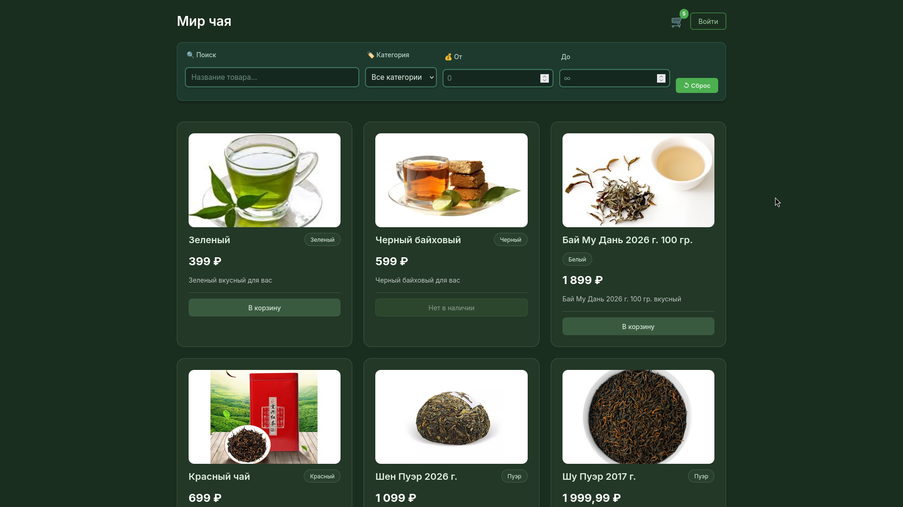
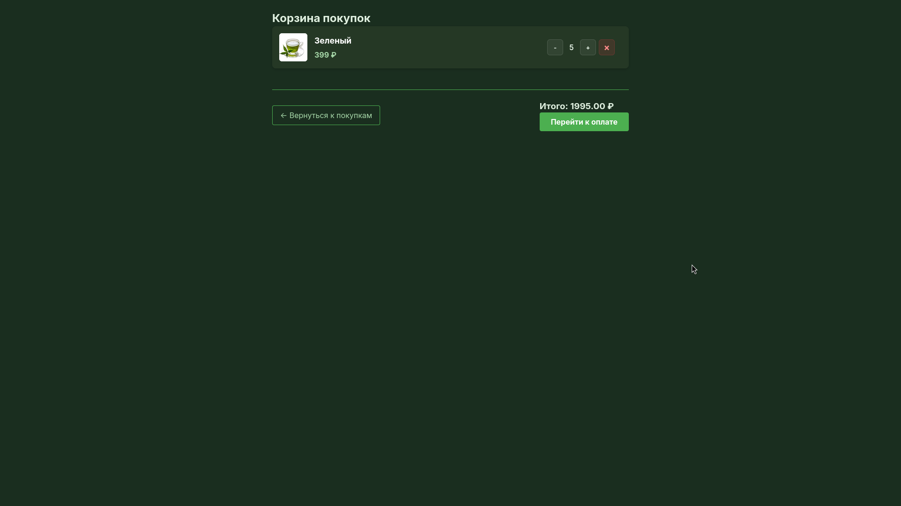
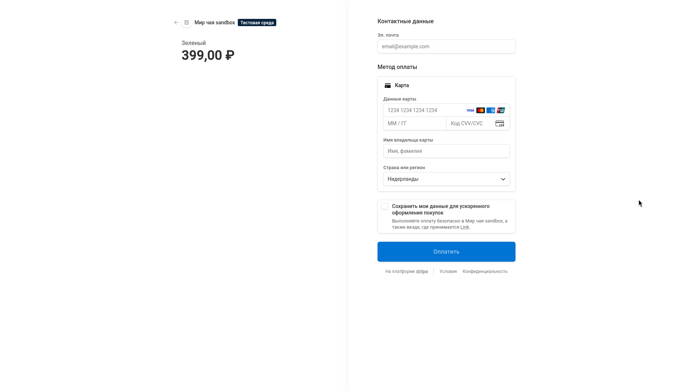
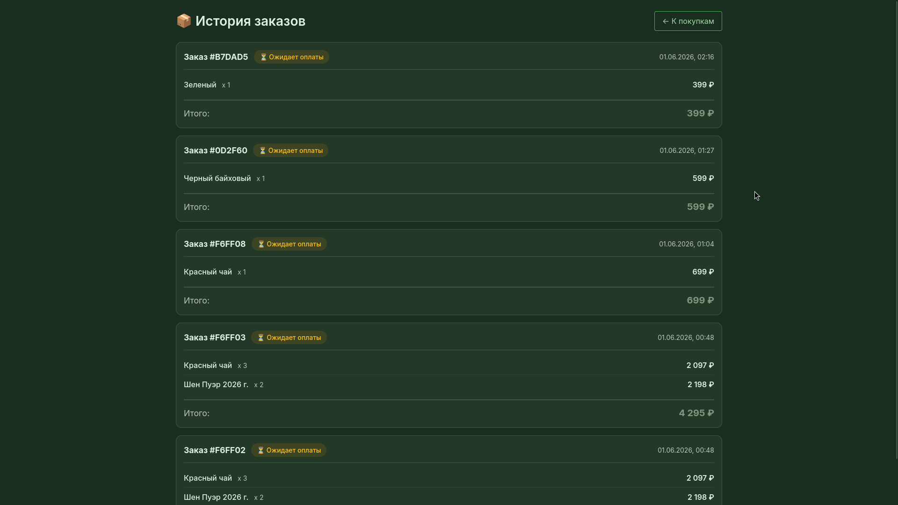
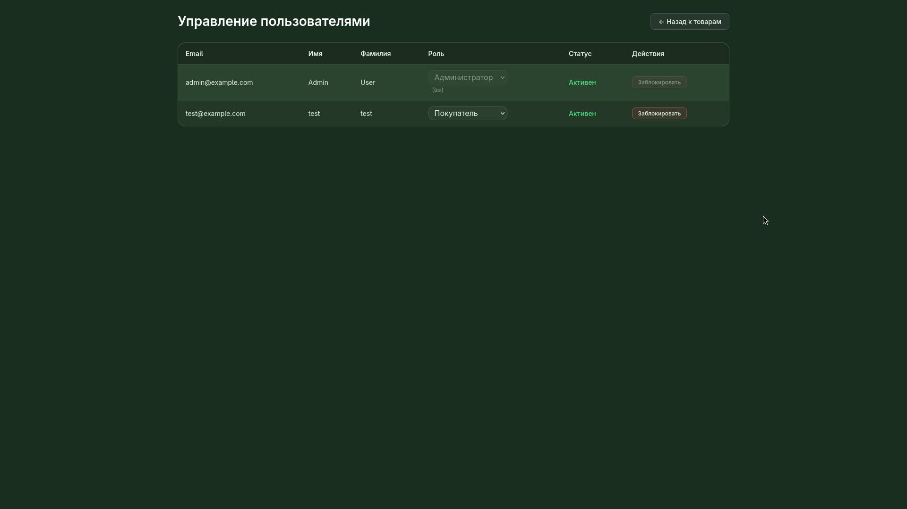
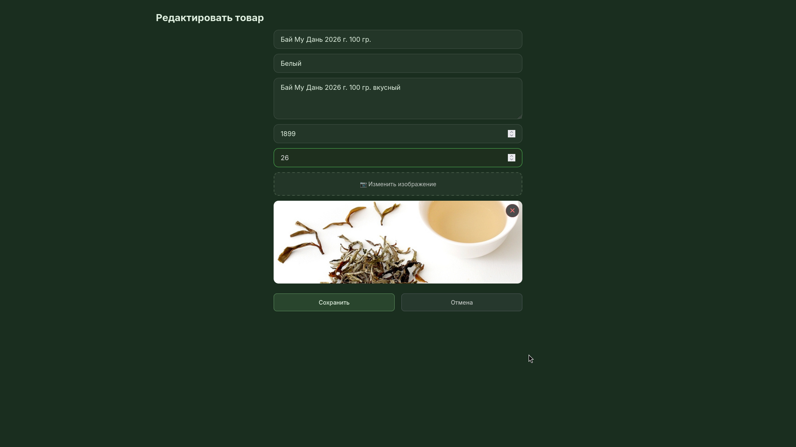

# 🛒 Интернет-магазин "Мир чая"

Полнофункциональное веб-приложение для продажи чая с корзиной покупок, интеграцией Stripe и панелью администратора.

**Студент:** Кайзер Даниил Дмитриевич  
**Группа:** ЭФБО-08-24  
**Дисциплина:** Фронтенд и бэкенд разработка

---

## 📋 Содержание

- [О проекте](#-о-проекте)
- [Функциональные возможности](#-функциональные-возможности)
- [Технологический стек](#-технологический-стек)
- [Архитектура приложения](#-архитектура-приложения)
- [Установка и запуск](#-установка-и-запуск)
- [Настройка Stripe](#-настройка-stripe)
- [Скриншоты](#-скриншоты)
- [API Документация](#-api-документация)
- [Тестирование](#-тестирование)

---

## 🎯 О проекте

Интернет-магазин с полным циклом покупок: от просмотра каталога до оплаты через Stripe. Приложение поддерживает ролевую модель (покупатель/администратор), управление инвентарём и историю заказов.

### Ключевые особенности:
- ✅ **Гостевой доступ** — просмотр товаров без регистрации
- ✅ **Корзина** — синхронизация между устройствами
- ✅ **Платежи** — безопасная оплата через Stripe
- ✅ **Инвентарь** — автоматическое обновление остатков
- ✅ **Балансировка** — 2 backend-сервера с nginx

---

## 🚀 Функциональные возможности

### Для покупателей:
- 🔍 Просмотр каталога с фильтрацией (поиск, категория, цена)
- 🛒 Добавление товаров в корзину
- 💳 Оформление заказа с оплатой через Stripe
- 📦 История заказов со статусами
- 👤 Личный кабинет

### Для администраторов:
- ➕ Добавление/редактирование товаров
- 📊 Управление инвентарём (количество на складе)
- 👥 Управление пользователями (блокировка, роли)
- 📸 Загрузка изображений товаров

---

## 🛠 Технологический стек

### Frontend:
- **React 19** — UI библиотека
- **React Router 7** — маршрутизация
- **Axios** — HTTP клиент
- **Sass** — стилизация
- **Stripe.js** — интеграция платежей

### Backend:
- **Node.js 18** + **Express 5**
- **MongoDB 6** — база данных
- **Redis 7** — кэширование
- **Mongoose 9** — ODM
- **JWT** — аутентификация
- **Bcrypt** — хеширование паролей
- **Multer** — загрузка файлов
- **Swagger** — API документация

### DevOps:
- **Docker** + **Docker Compose**
- **Nginx** — балансировка нагрузки
- **Git** — контроль версий

---

## 🏗 Архитектура приложения

```
┌─────────────┐
│   Nginx     │ (Port 80)
│  (Balancer) │
└──────┬──────┘
       │
    ┌──┴──┐
    │     │
┌───▼──┐ ┌▼────┐
│Back- │ │Back-│
│ end1 │ │ end2│
└───┬──┘ └┬────┘
    │     │
┌───▼─────▼────┐
│   MongoDB    │
│   + Redis    │
└──────────────┘
```

### Компоненты:
| Сервис | Порт | Описание |
|--------|------|----------|
| **Nginx** | 80 | Балансировщик (Round Robin) |
| **Backend1** | 3000 | Основной сервер |
| **Backend2** | 3000 | Резервный сервер |
| **MongoDB** | 27017 | База данных |
| **Redis** | 6379 | Кэш-сервер |
| **Frontend** | 3003 | React приложение |

---

## 📦 Установка и запуск

### Предварительные требования:
- Docker и Docker Compose
- Node.js 18+ (для фронтенда)
- Git

### 1. Клонирование репозитория:
```bash
git clone https://github.com/ZenesDK/E-commerce-fullstack-tea-shop
cd practic28
```

### 2. Настройка переменных окружения:

Создайте файл `.env` в корне проекта:

```env
# Stripe API Keys (получите на https://dashboard.stripe.com/test/apikeys)
STRIPE_SECRET_KEY=sk_test_your_secret_key_here
STRIPE_WEBHOOK_SECRET=whsec_your_webhook_secret_here

# JWT Secrets
ACCESS_SECRET=your_access_secret_key
REFRESH_SECRET=your_refresh_secret_key

# URLs
CLIENT_URL=http://localhost:3003
MONGODB_URI=mongodb://mongodb:27017/tea_shop_db
REDIS_URL=redis://redis:6379
```

### 3. Запуск backend (Docker):

```bash
# Сборка и запуск всех контейнеров
docker compose up --build

# Или в фоновом режиме
docker compose up --build -d

# Просмотр логов
docker compose logs -f

# Остановка
docker compose down
```

### 4. Запуск frontend (локально):

```bash
cd frontend
npm install
PORT=3003 npm start
```

### 5. Создание администратора:

```bash
docker compose exec backend1 node --experimental-global-webcrypto src/config/initAdmin.js
```

**Данные для входа:**
- Email: `admin@example.com`
- Пароль: `admin123`

---

## 💳 Настройка Stripe

### 1. Регистрация:
1. Зайдите на [Stripe Dashboard](https://dashboard.stripe.com/register)
2. Создайте аккаунт (тестовый режим)

### 2. Получение ключей:

#### Secret Key:
1. Перейдите в **Developers** → **API keys**
2. Скопируйте **Secret key** (начинается с `sk_test_`)
3. Вставьте в `.env`:
   ```env
   STRIPE_SECRET_KEY=sk_test_...
   ```

#### Webhook Secret:
1. Перейдите в **Developers** → **Webhooks**
2. Нажмите **Add endpoint**
3. URL: `http://localhost/api/webhooks/stripe`
4. Выберите события:
   - ✅ `checkout.session.completed`
5. Скопируйте **Signing secret** (начинается с `whsec_`)
6. Вставьте в `.env`:
   ```env
   STRIPE_WEBHOOK_SECRET=whsec_...
   ```

### 3. Тестовые карты:

| Карта | Результат |
|-------|-----------|
| `4242 4242 4242 4242` | Успешная оплата |
| `4000 0000 0000 0002` | Отклонена |
| `4000 0025 0000 3155` | Требует 3D Secure |

Любой будущий срок и CVC.

---

## 📸 Скриншоты

### Главная страница (Каталог товаров)

*Просмотр товаров с фильтрацией и поиском*

### Корзина покупок

*Управление товарами в корзине*

### Оформление заказа (Stripe Checkout)

*Безопасная оплата через Stripe*

### История заказов

*Просмотр статусов заказов*

### Панель администратора

*Управление товарами и пользователями*

### Редактирование товара

*Изменение информации о товаре и остатков*

---

## 📚 API Документация

### Swagger UI:
После запуска backend откройте:
```
http://localhost/api-docs
```

### Основные endpoints:

#### Auth:
- `POST /api/auth/register` — Регистрация
- `POST /api/auth/login` — Вход
- `POST /api/auth/refresh` — Обновление токена
- `GET /api/auth/me` — Текущий пользователь

#### Products:
- `GET /api/products` — Список товаров (с фильтрами)
- `GET /api/products/:id` — Товар по ID
- `POST /api/products` — Создать товар (Admin)
- `PUT /api/products/:id` — Обновить товар (Admin)
- `DELETE /api/products/:id` — Удалить товар (Admin)

#### Cart:
- `GET /api/cart` — Получить корзину
- `POST /api/cart/add` — Добавить товар
- `PUT /api/cart/update/:productId` — Обновить количество
- `DELETE /api/cart/remove/:productId` — Удалить товар

#### Orders:
- `POST /api/orders/checkout` — Создать заказ (Stripe)
- `GET /api/orders/history` — История заказов
- `POST /api/orders/confirm` — Подтвердить оплату

#### Users (Admin only):
- `GET /api/users` — Список пользователей
- `PUT /api/users/:id` — Обновить пользователя
- `DELETE /api/users/:id` — Заблокировать
- `PATCH /api/users/:id/unblock` — Разблокировать

---

## 🧪 Тестирование

### Проверка балансировки:
```bash
curl http://localhost/api/check-balance
curl http://localhost/api/check-balance
# Запросы должны чередоваться между backend1 и backend2
```

### Проверка кэширования:
```bash
# Первый запрос (кэш MISS)
curl http://localhost/api/products

# Второй запрос (кэш HIT)
curl http://localhost/api/products
```

### Проверка отказоустойчивости:
```bash
# Остановить один backend
docker compose stop backend1

# Запросы должны идти на backend2
curl http://localhost/api/check-balance

# Вернуть backend
docker compose start backend1
```

---

## 🔐 Безопасность

- **JWT токены** — access (15 мин) + refresh (7 дней)
- **Bcrypt** — хеширование паролей (10 rounds)
- **CORS** — ограничение домена
- **Role-based access** — разграничение прав
- **Input validation** — проверка всех входных данных

---

## 📊 Кэширование

### Redis кэш:
| Endpoint | TTL | Ключ |
|----------|-----|------|
| `GET /api/products` | 600 сек | `products:all` |
| `GET /api/products/:id` | 600 сек | `products:{id}` |
| `GET /api/users` | 60 сек | `users:all` |

### Инвалидация:
Автоматическая при:
- Создании товара
- Обновлении товара
- Удалении товара
- Изменении stock после оплаты

---

## 🐳 Docker команды

```bash
# Просмотр запущенных контейнеров
docker compose ps

# Логи конкретного сервиса
docker compose logs -f backend1
docker compose logs -f mongodb

# Вход в контейнер
docker compose exec backend1 sh
docker compose exec mongodb mongosh tea_shop_db

# Перезапуск сервиса
docker compose restart nginx

# Полная очистка (включая тома)
docker compose down -v

# Пересборка без кэша
docker compose build --no-cache
```

---

## 📝 Структура проекта

```
practic28/
├── backend/
│   ├── src/
│   │   ├── config/          # Конфигурация (DB, Swagger)
│   │   ├── controllers/     # Контроллеры
│   │   ├── middleware/      # Auth, Cache, Upload
│   │   ├── models/          # Mongoose схемы
│   │   ├── repositories/    # Data access layer
│   │   ├── routes/          # API routes
│   │   └── services/        # CacheService
│   ├── Dockerfile
│   └── server.js
├── frontend/
│   ├── src/
│   │   ├── api/             # API client
│   │   ├── components/      # UI components
│   │   ├── context/         # CartContext
│   │   └── pages/           # Страницы
│   └── package.json
├── nginx/
│   └── nginx.conf
├── docker-compose.yml
└── README.md
```

---

## 👨‍💻 Разработка

### Frontend development:
```bash
cd frontend
npm start  # Hot reload на localhost:3003
```

### Backend development:
```bash
cd backend
npm run dev  # Nodemon с авто-перезагрузкой
```

### Полезные ссылки:
- [React Docs](https://react.dev)
- [Express Guide](https://expressjs.com)
- [MongoDB Docs](https://mongodb.com/docs)
- [Stripe API](https://stripe.com/docs/api)

---

## 📄 Лицензия

MIT License — свободно используйте в учебных целях.

---

**Сделано с ❤️ для учебного проекта**